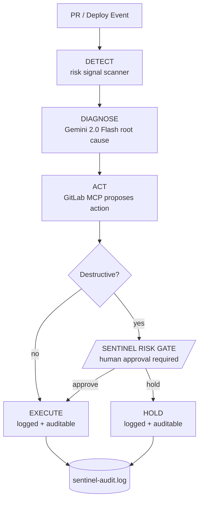

# Sentinel
### The AI agent that knows when not to ship.

> Google Cloud Rapid Agent Hackathon submission

---

## What It Does

Sentinel is a deployment risk guardian. When a developer opens a PR or triggers a deployment, Sentinel:

1. **Detects** risk signals: file churn, config changes, test regressions, production targets
2. **Diagnoses** root cause with Gemini 2.0 Flash
3. **Proposes** actions via GitLab MCP tools (rollback, alert, hold)
4. **Gates** any destructive action behind human approval
5. **Executes** only with explicit sign-off — every decision logged

**The gate is the differentiator.** AI suggests. You decide. Sentinel remembers.

---

## Quick Start

```bash
git clone https://github.com/RLASAF12/sentinel-hackathon
cd sentinel-hackathon
pip install -r requirements.txt

# Demo mode (no API keys required) — full pipeline with mock MCP + heuristic diagnosis
python -m src.sentinel.main --demo

# With real APIs
export GEMINI_API_KEY=your_key
export GITLAB_TOKEN=your_token
python -m src.sentinel.main

# Run the tests
pytest -q

# Run the Cloud Run health server locally
python -m src.sentinel.main --serve   # then: curl localhost:8080/health

# Web UI — the approval moment in the browser
python -m src.sentinel.web            # then open http://localhost:8080
```

> **Qualification-stack rebuild (in progress):** `src/sentinel/agent.py` rebuilds
> the orchestration as a Google ADK `LlmAgent` on **Gemini 3** whose tools are the
> **real GitLab MCP server**, with the human gate enforced via a
> `before_tool_callback`. It's written against the verified ADK API but must be
> installed/run/deployed from a Google Cloud session — see
> [`WINNING-BUILD-PROMPT.md`](WINNING-BUILD-PROMPT.md).

At the gate, type `y` to approve, `n` to hold, or `d` to inspect evidence.
A captured run is in [`docs/demo-capture.txt`](docs/demo-capture.txt).

---

## The Differentiator

Most AI agents act. Sentinel **stops**.

Every other deployment bot races to fix prod on its own. Sentinel does the
analysis, proposes the fix, and then **halts at a human gate** before anything
destructive runs — showing you what it wants to do, why, the risk score, and
the alternatives. AI suggests. You decide. Every decision is logged.

That gate is the whole point. It's the line between *AI assistance* and
*AI autonomy over production* — and engineers want the former.

---

## Architecture



```
[PR / Deploy Event]
        |
   [DETECT]    Risk signal scanner
        |
   [DIAGNOSE]  Gemini 2.0 Flash root cause analysis
        |
   [ACT]       GitLab MCP tool selection
        |
   [GATE]  <-- HUMAN APPROVAL REQUIRED (if destructive)
        |
[SHIP / HOLD]  Logged, auditable
```

Multi-agent system (Google ADK): Orchestrator + 7 specialized subagents + 5 workflow commands.

---

## The Risk Gate

```
╭───────────────────────── SENTINEL RISK GATE ──────────────────────────╮
│  Action      ROLLBACK pipeline #12345                                  │
│  Risk Score  98%                                                       │
│  Type        ROLLBACK                                                  │
│  Evidence 1  Large deployment scope + infra/config changes            │
│  Evidence 2  Delay 2h and notify the on-call team                     │
│  Evidence 3  Restore test coverage before deploying                   │
╰───────── Human approval required — AI cannot proceed alone ───────────╯

Approve? (y) / (n) / (d)etails:
```

Before any destructive action runs, Sentinel shows you what, why, risk score, and alternatives. You decide. No autonomous destructive actions — ever.

Every decision is appended to `sentinel-audit.log` as a JSON line:

```json
{"timestamp": "2026-06-06T11:22:48Z", "action": "rollback", "destructive": true,
 "risk_score": 0.98, "approved": false, "approver": "human-cli", "notes": "Decision: 'n'"}
```

**Fail-safe by design:** anything other than an explicit `y` holds the action.
In non-interactive contexts (CI, piped recordings) the gate denies by default
unless `SENTINEL_AUTO_APPROVE=true` is set.

---

## Google Cloud

| Component | Role |
|-----------|------|
| Gemini 2.0 Flash | Risk diagnosis, root cause analysis |
| Google ADK | Multi-agent orchestration |
| Cloud Run | Deployment target (`Dockerfile` + `deploy.sh`, `/health` endpoint) |

Deploy: `PROJECT_ID=<id> ./deploy.sh` (builds with Cloud Build, deploys to Cloud Run).
Gemini is called lazily — in demo mode a deterministic heuristic stands in so the
pipeline runs with zero credentials.

---

## MCP Integration

Uses the official **GitLab MCP server**. Wrapped tools:
- `get_merge_request_diff` — fetch diff for analysis
- `create_merge_request_note` — post risk assessment comment
- `cancel_pipeline` — rollback (always gated before execution)

---

## Responsible AI

The gate is a design principle, not a UI checkbox:
- AI cannot execute destructive actions without human approval
- Every decision is logged: timestamp, approver, risk score, context
- Audit log is append-only
- Demo and production mode both enforce the gate

---

## Using This Repo with Claude Code

Clone this repo, open in Claude Code, then:
```
Run W1.
```

W1 locks scope. W2 builds the core. W3 wires integrations. W4 records demo and submits. W5 polishes.

---

## Repo Structure

```
sentinel-hackathon/
+-- CLAUDE.md          Orchestrator master prompt (start here for Claude Code)
+-- PLAN.md            5-day sprint plan + rubric map
+-- agents/            7 subagent definitions
+-- workflows/         W1-W5 Claude Code workflow commands
+-- src/sentinel/      Core pipeline: detect, diagnose, act, gate, main
+-- src/mcp/           GitLab MCP client + demo mock
+-- docs/              Demo script + capture, submission draft, ADR, MCP setup
+-- tests/             Test suite (pytest)
+-- Dockerfile         Cloud Run image
+-- deploy.sh          Cloud Run deploy script
```

---

## Demo

- **Video:** _[add unlisted YouTube/Loom URL after recording — see `docs/demo-script.md`]_
- **Captured run:** [`docs/demo-capture.txt`](docs/demo-capture.txt) (golden path, gate approved)

Record with:

```bash
export SENTINEL_DEMO=true
clear
python -m src.sentinel.main --demo
# type 'y' at the gate — let the panel breathe for 2+ seconds (the money shot)
```

---

## License

[MIT](LICENSE) © 2026 Harel Asaf

---

*Google Cloud Rapid Agent Hackathon | 2026*
