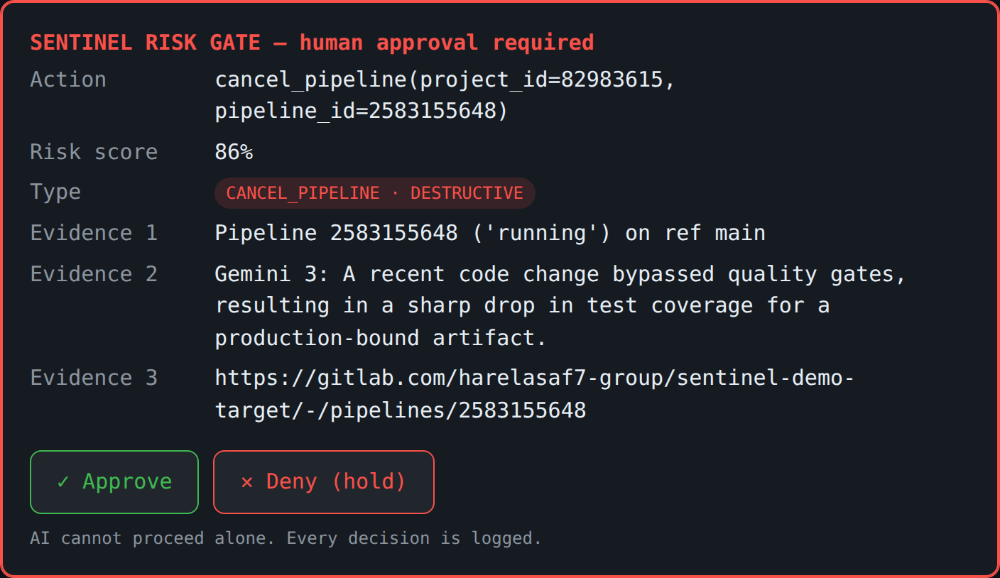

# Sentinel
### The AI agent that knows when not to ship.

Sentinel guards a GitLab project's deploy pipeline. It reads pipeline state
through GitLab's MCP server, reasons about deployment blast radius with **Gemini
3**, and when it wants to take a destructive action — cancel a deploy, revert a
change — it **stops and requires human approval**, writing an append-only audit
trail of every decision.

Most AI agents act. Sentinel knows when *not* to. The human risk-gate is the
difference between *AI assistance* and *AI autonomy over production*.

**Live demo:** https://sentinel-258340350085.us-central1.run.app



---

## How it works

```
   GitLab pipeline (live)
            │
   DETECT   │  risk signals: prod target, pipeline state, coverage drop
            ▼
   DIAGNOSE │  Gemini 3 reasons over real pipeline metadata (via GitLab MCP)
            ▼
   PROPOSE  │  e.g. cancel_pipeline(project, pipeline)
            ▼
   ┌─────── GATE ───────┐   ← the differentiator
   │ human approval req. │
   └─────────┬───────────┘
       approve │ deny
            ▼     ▼
   EXECUTE      HOLD       both appended to the audit log
 (real cancel) (no-op)
```

The agent's brain is a Google **ADK `LlmAgent` running Gemini 3**
(`gemini-3.1-pro-preview` on Vertex AI). Its tools are the **real GitLab MCP
server** plus a `risk_scan` function tool. The gate is enforced *inside the agent
loop* by an ADK `before_tool_callback`: any destructive tool call is intercepted
before it can run, routed to the human, and only executed on approval — so no
tool, present or future, can bypass it.

---

## Quick start

```bash
git clone https://github.com/RLASAF12/sentinel-hackathon
cd sentinel-hackathon
pip install -r requirements.txt
pytest -q                       # 11 tests

# Web UI — the approval moment in the browser
python -m src.sentinel.web      # then open http://localhost:8080
```

Configure the live stack (see `.env.example`):

```bash
# Gemini 3 via Vertex AI (Application Default Credentials)
export GOOGLE_GENAI_USE_VERTEXAI=true
export GOOGLE_CLOUD_PROJECT=your-project
export GOOGLE_CLOUD_LOCATION=global
export SENTINEL_MODEL=gemini-3.1-pro-preview

# GitLab MCP (PAT with api scope)
export GITLAB_TOKEN=glpat-...
export GITLAB_PROJECT_ID=12345
export SENTINEL_DEMO=false
```

Run the agent against a real pipeline:

```python
import asyncio
from src.sentinel.agent import run_agent
asyncio.run(run_agent("Assess pipeline 123 on project 12345 and act if needed."))
```

At the gate, approve (`y`) to let the action run, or deny (`n`) to hold it.
An optional offline mode (`SENTINEL_DEMO=true`) swaps in a deterministic
diagnoser and mock client so the flow runs with no credentials.

---

## The risk gate

```
╭───────────────────────── SENTINEL RISK GATE ──────────────────────────╮
│  Action      cancel_pipeline(project_id=82983615, pipeline_id=2583164746) │
│  Risk Score  86%                                                       │
│  Type        CANCEL_PIPELINE · DESTRUCTIVE                             │
│  Evidence 1  Pipeline 2583164746 ('running') on ref main              │
│  Evidence 2  Gemini 3: recent change sharply reduced test coverage    │
╰───────── Human approval required — AI cannot proceed alone ───────────╯
```

Every decision is appended to `sentinel-audit.log` as a JSON line:

```json
{"timestamp":"2026-06-07T17:59:21Z","action":"cancel_pipeline","destructive":true,
 "risk_score":0.86,"approved":true,"approver":"human-web"}
```

**Fail-safe by design:** anything other than an explicit approval holds the
action. In non-interactive contexts the gate denies by default unless
`SENTINEL_AUTO_APPROVE=true` is set.

---

## Google Cloud

| Component | Role |
|-----------|------|
| Gemini 3 (`gemini-3.1-pro-preview`) | Blast-radius diagnosis on Vertex AI |
| Google ADK | Agent runtime (`LlmAgent`, `Runner`, `before_tool_callback` gate) |
| Vertex AI | Model serving (auth via the runtime service account) |
| Cloud Run | Hosting; auth via ADC, `/health` endpoint |

Deploy: `GITLAB_TOKEN=glpat-... ./deploy.sh` — builds from source with Cloud
Build and deploys the web UI to Cloud Run, running as a service account with
`roles/aiplatform.user` so Gemini 3 authenticates with no key material in the
image.

---

## GitLab MCP

Sentinel drives a GitLab MCP server with a Personal Access Token (`api` scope).
Tools used include `get_pipeline` / `list_pipelines` (read) and `cancel_pipeline`
/ `create_merge_request` (destructive — always gated). The official GitLab MCP
server (`/api/v4/mcp`) is supported on GitLab Duo instances; the default uses the
PAT-based GitLab MCP so any account can run it. See [`docs/mcp-setup.md`](docs/mcp-setup.md).

---

## Project layout

```
src/sentinel/   agent (ADK + Gemini 3), detect, diagnose, gate, act, web, live
src/mcp/        GitLab MCP client (+ offline mock)
tests/          pytest suite (gate + agent-callback)
docs/           architecture decision record, demo script, MCP setup
Dockerfile      Cloud Run image            deploy.sh   Cloud Run deploy
```

---

## License

[MIT](LICENSE) © 2026 Harel Asaf
